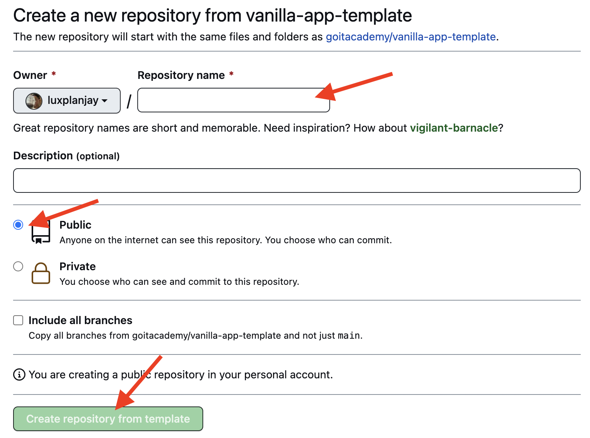

# Vanilla App Template

Цей проект було створено за допомогою Vite. Для знайомства та налаштування
додаткових можливостей [звернись до документації](https://vitejs.dev/).

## Створення репозиторію за шаблоном

Використовуй цей репозиторій організації GoIT як шаблон для створення
репозиторію свого проекту. Для цього натисни на кнопку `«Use this template»` і
обери опцію `«Create a new repository»`, як показано на зображенні.


На наступному етапі відкриється сторінка створення нового репозиторію. Заповни
поле його імені, переконайся, що репозиторій публічний, після чого натисни
кнопку `«Create repository from template»`.



Після того, як репозиторій буде створено, необхідно перейти в налаштування
створеного репозиторію на вкладку `Settings` > `Actions` > `General` як показано
на зображенні.


Проскроливши сторінку до самого кінця, в секції `«Workflow permissions»` обери
опцію `«Read and write permissions»` і постав галочку в чекбоксі. Це необхідно
для автоматизації процесу деплою проекту.


Тепер у тебе є особистий репозиторій проекту, зі структурою файлів та папок
репозиторію-шаблону. Далі працюй з ним, як з будь-яким іншим особистим
репозиторієм, клонуй його собі на комп'ютер, пиши код, роби коміти та відправляй
їх на GitHub.

## Підготовка до роботи

1. Переконайся, що на комп'ютері встановлено LTS-версію Node.js.
   [Скачай та встанови](https://nodejs.org/en/) її якщо необхідно.
2. Встанови базові залежності проекту в терміналі командою `npm install`.
3. Запусти режим розробки, виконавши в терміналі команду `npm run dev`.
4. Перейдіть у браузері за адресою
   [http://localhost:5173](http://localhost:5173). Ця сторінка буде автоматично
   перезавантажуватись після збереження змін у файли проекту.

## Файли і папки

- Файли розмітки компонентів сторінки повинні лежати в папці `src/partials` та
  імпортуватись до файлу `index.html`. Наприклад, файл з розміткою хедера
  `header.html` створюємо у папці `partials` та імпортуємо в `index.html`.
- Файли стилів повинні лежати в папці `src/css` та імпортуватись до HTML-файлів
  сторінок. Наприклад, для `index.html` файл стилів називається `index.css`.
- Зображення додавай до папки `src/img`. Збирач оптимізує їх, але тільки при
  деплої продакшн версії проекту. Все це відбувається у хмарі, щоб не
  навантажувати твій комп'ютер, тому що на слабких компʼютерах це може зайняти
  багато часу.

## Деплой

Продакшн версія проекту буде автоматично збиратися та деплоїтись на GitHub
Pages, у гілку `gh-pages`, щоразу, коли оновлюється гілка `main`. Наприклад,
після прямого пуша або прийнятого пул-реквесту. Для цього необхідно у файлі
`package.json` змінити значення прапора `--base=/<REPO>/`, для команди `build`,
замінивши `<REPO>` на назву свого репозиторію, та відправити зміни на GitHub.

```json
"build": "vite build --base=/<REPO>/",
```

Далі необхідно зайти в налаштування GitHub-репозиторію (`Settings` > `Pages`) та
виставити роздачу продакшн версії файлів з папки `/root` гілки `gh-pages`, якщо
це не було зроблено автоматично.


### Статус деплою

Статус деплою крайнього коміту відображається іконкою біля його ідентифікатора.

- **Жовтий колір** - виконується збірка та деплой проекту.
- **Зелений колір** - деплой завершився успішно.
- **Червоний колір** - під час лінтингу, збірки чи деплою сталася помилка.

Більш детальну інформацію про статус можна переглянути натиснувши на іконку, і в
вікні, що випадає, перейти за посиланням `Details`.


### Жива сторінка

Через якийсь час, зазвичай кілька хвилин, живу сторінку можна буде подивитися за
адресою, вказаною на вкладці `Settings` > `Pages` в налаштуваннях репозиторію.
Наприклад, ось посилання на живу версію для цього репозиторію

[https://goitacademy.github.io/vanilla-app-template/](https://goitacademy.github.io/vanilla-app-template/).

Якщо відкриється порожня сторінка, переконайся, що у вкладці `Console` немає
помилок пов'язаних з неправильними шляхами до CSS та JS файлів проекту
(**404**). Швидше за все у тебе неправильне значення прапора `--base` для
команди `build` у файлі `package.json`.

## Як це працює


Критерії приймання
Створено репозиторій goit-advancedjs-hw-04.
Домашня робота містить два посилання: на вихідні файли і робочу сторінку на GitHub Pages.
До роботи прiкрiплено файл репозиторiю у форматi zip.
В консолі відсутні помилки і попередження під час відкриття живої сторінки завдання.
Проект зібраний за допомогою vanilla-app-template.
Для HTTP-запитів використана бібліотека axios.
Використовується синтаксис async/await.
Для повідомлень використана бібліотека iziToast.
Код відформатований за допомогою Prettier.
Формат оцінювання:

Оцінка від 0 до 100
Формат здачi:

Два посилання: на вихідні файли і робочу сторінку на GitHub Pages
Прикрiплений файл репозиторію у форматi zip
ВАЖЛИВО
Переглянь Iнструкцію щодо завантаження робочого файлу з репозиторію на Github

Завдання. Пошук зображень
Створи фронтенд частину застосунку пошуку і перегляду зображень за ключовим словом. Додай оформлення елементів інтерфейсу.

Подивись демо-відео роботи застосунку.

Форма пошуку
Форма спочатку міститья в HTML документі. Користувач буде вводити рядок для пошуку у текстове поле, а по сабміту форми необхідно виконувати HTTP-запит.

<form class="search-form" id="search-form">
<input
type="text"
name="searchQuery"
autocomplete="off"
placeholder="Search images..."
/>
<button type="submit">Search</button>
</form>

HTTP-запити
Для бекенду використовуй публічний API сервісу Pixabay. Зареєструйся, отримай свій унікальний ключ доступу і ознайомся з документацією.

Список параметрів рядка запиту, які тобі обов'язково необхідно вказати:

key - твій унікальний ключ доступу до API.
q - термін для пошуку. Те, що буде вводити користувач.
image_type - тип зображення. На потрібні тільки фотографії, тому постав значення photo.
orientation - орієнтація фотографії. Постав значення horizontal.
safesearch - фільтр за віком. Постав значення true.
У відповіді буде масив зображень, що задовольнили критерії параметрів запиту. Кожне зображення описується об'єктом, з якого тобі цікаві тільки наступні властивості:

webformatURL - посилання на маленьке зображення для списку карток.
largeImageURL - посилання на велике зображення.
tags - рядок з описом зображення. Підійде для атрибуту alt.
likes - кількість лайків.
views - кількість переглядів.
comments - кількість коментарів.
downloads - кількість завантажень.
Якщо бекенд повертає порожній масив, значить нічого підходящого не було знайдено. У такому разі показуй повідомлення з текстом "Sorry, there are no images matching your search query. Please try again.". Для повідомлень використовуй бібліотеку notiflix.

Галерея і картка зображення
Елемент div.gallery спочатку міститься в HTML документі, і в нього необхідно рендерити розмітку карток зображень. Під час пошуку за новим ключовим словом необхідно повністю очищати вміст галереї, щоб не змішувати результати.

<div class="gallery">
<!-- Картки зображень -->
</div>

Шаблон розмітки картки одного зображення для галереї.

<div class="photo-card">
    
    <div class="info">
        <p class="info-item">
            <b>Likes</b>
        </p>
            <p class="info-item">
        <b>Views</b>
        </p>
        <p class="info-item">
            <b>Comments</b>
        </p>
        <p class="info-item">
            <b>Downloads</b>
        </p>
    </div>
</div>

Пагінація
Pixabay API підтримує пагінацію і надає параметри page і per_page. Зроби так, щоб в кожній відповіді приходило 40 об'єктів (за замовчуванням 20).

Початкове значення параметра page повинно бути 1.
З кожним наступним запитом, його необхідно збільшити на 1.
У разі пошуку за новим ключовим словом, значення page потрібно повернути до початкового, оскільки буде пагінація по новій колекції зображень.
HTML документ вже містить розмітку кнопки, по кліку на яку, необхідно виконувати запит за наступною групою зображень і додавати розмітку до вже існуючих елементів галереї.

<button type="button" class="load-more">Load more</button>

В початковому стані кнопка повинна бути прихована.
Після першого запиту кнопка з'являється в інтерфейсі під галереєю.
При повторному сабміті форми кнопка спочатку ховається, а після запиту знову відображається.
У відповіді бекенд повертає властивість totalHits - загальна кількість зображень, які відповідають критерію пошуку (для безкоштовного акаунту). Якщо користувач дійшов до кінця колекції, ховай кнопку і виводь повідомлення з текстом "We're sorry, but you've reached the end of search results."

Додатково
УВАГА
Наступний функціонал не обов'язковий для здавання завдання, але буде хорошою додатковою практикою.

Повідомлення
Після першого запиту з кожним новим пошуком отримувати повідомлення, в якому буде написано, скільки всього знайшли зображень (властивість totalHits). Текст повідомлення - "Hooray! We found totalHits images."

Бібліотека SimpleLightbox
Додати відображення великої версії зображення з бібліотекою SimpleLightbox для повноцінної галереї.

У розмітці необхідно буде обгорнути кожну картку зображення у посилання, як зазначено в документації.
Бібліотека містить метод refresh(), який обов'язково потрібно викликати щоразу після додавання нової групи карток зображень.
Для того щоб підключити CSS код бібліотеки в проект, необхідно додати ще один імпорт, крім того, що описаний в документації.

// Описаний в документації
import SimpleLightbox from "simplelightbox";
// Додатковий імпорт стилів
import "simplelightbox/dist/simple-lightbox.min.css";

Прокручування сторінки
Зробити плавне прокручування сторінки після запиту і відтворення кожної наступної групи зображень. Ось тобі код-підказка, але розберися у ньому самостійно.

const { height: cardHeight } = document
.querySelector(".gallery")
.firstElementChild.getBoundingClientRect();

window.scrollBy({
top: cardHeight * 2,
behavior: "smooth",
});

Нескінченний скрол
Замість кнопки «Load more», можна зробити нескінченне завантаження зображень під час прокручування сторінки. Ми надаємо тобі повну свободу дій в реалізації, можеш використовувати будь-які бібліотеки.

1. Після кожного пуша у гілку `main` GitHub-репозиторію, запускається
   спеціальний скрипт (GitHub Action) із файлу `.github/workflows/deploy.yml`.
2. Усі файли репозиторію копіюються на сервер, де проект ініціалізується та
   проходить лінтинг та збірку перед деплоєм.
3. Якщо всі кроки пройшли успішно, зібрана продакшн версія файлів проекту
   відправляється у гілку `gh-pages`. В іншому випадку, у лозі виконання скрипта
   буде вказано в чому проблема.
